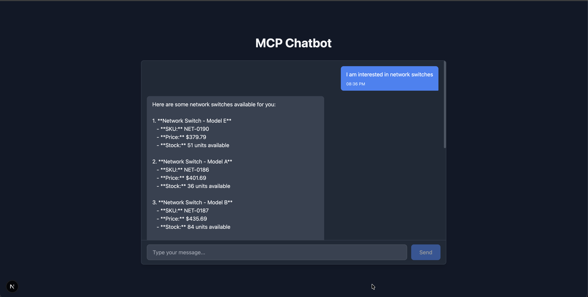
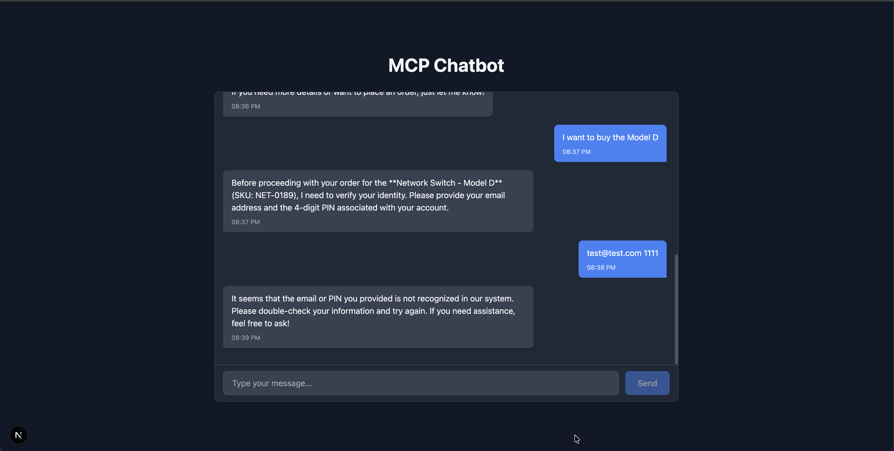
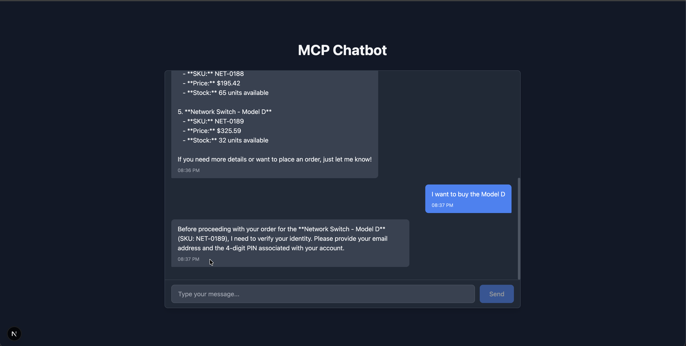
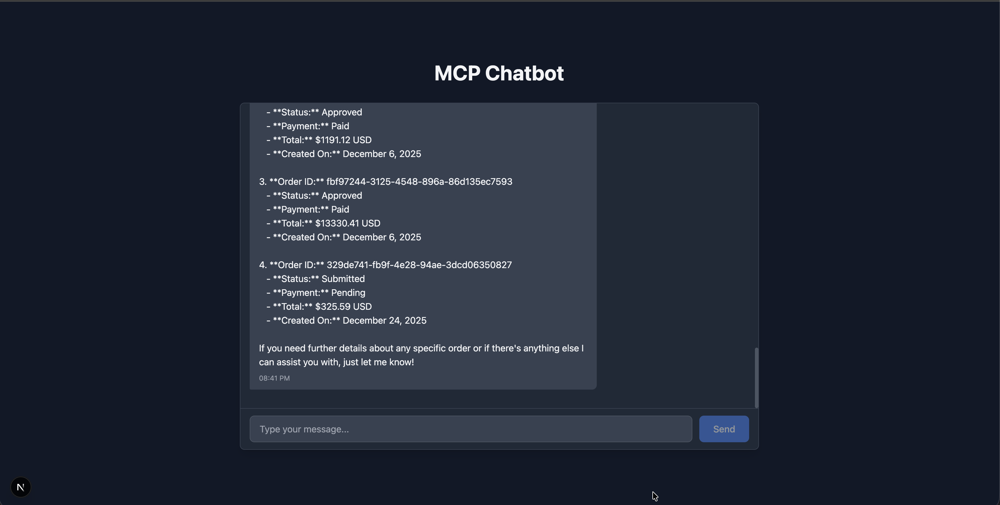
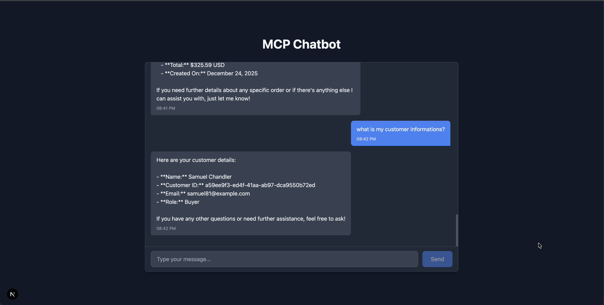

# MCP Customer Support Chatbot

An intelligent customer support chatbot powered by OpenAI GPT that orchestrates interactions with an MCP (Model Context Protocol) server. The chatbot understands natural language queries and automatically utilizes MCP server primitives (tools, resources, and prompts) to provide intelligent customer support.

## Features

- **Natural Language Understanding**: Ask questions naturally, no command syntax required
- **In-Chat Authentication**: When accessing orders, the AI asks for email + PIN directly in conversation
- **LLM Orchestration**: OpenAI GPT-4o-mini intelligently decides which MCP tools to call
- **Full MCP Primitives Support**: Utilizes tools, resources, and prompts from the MCP server
- **Multi-Turn Conversations**: Maintains context across conversation turns
- **Automatic Tool Calling**: GPT automatically invokes appropriate tools based on context
- **Product Search & Management**: Browse products, check inventory, get detailed information
- **Order Management**: View order history and place new orders with MCP server verification
- **Real-time MCP Connection**: Streamable HTTP transport for efficient server communication

## Screenshots

<table>
<tr>
<td align="center">
  
  <br />
  <strong>Product Query</strong>
</td>
<td align="center">
  
  <br />
  <strong>Invalid Authentication</strong>
</td>
<td align="center">
  
  <br />
  <strong>In-Chat Authentication</strong>
</td>
<td align="center">
  
  <br />
  <strong>Previous Orders</strong>
</td>
</tr>
<tr>
<td align="center">
  
  <br />
  <strong>Customer Info</strong>
</td>
<td align="center">
  
  <br />
  <strong>Success Auth Create Order</strong>
</td>
</tr>
</table>

## Getting Started

### 1. Install Dependencies

```bash
npm install
```

### 2. Configure Environment

Copy `.env.example` to `.env.local` and configure the required environment variables:

```bash
cp .env.example .env.local
```

Edit `.env.local` and add your configuration:

```env
# Required: MCP Server URL
MCP_SERVER_URL=

# Required: OpenAI API Key
OPENAI_API_KEY=sk-your-actual-api-key-here

# Optional: OpenAI Model (defaults to gpt-4o-mini)
OPENAI_MODEL=gpt-4o-mini

# Optional: MCP Server API Key (if the server requires authentication)
MCP_SERVER_API_KEY=

# Optional: Next.js App URL (defaults to http://localhost:3000)
NEXT_PUBLIC_APP_URL=http://localhost:3000

```

**Important**: 
- Replace `your-actual-api-key-here` with your actual OpenAI API key from https://platform.openai.com/api-keys
- Set `MCP_SERVER_URL` to your MCP server endpoint
- The other variables are optional and have defaults

### 3. Run Development Server

```bash
npm run dev
```

### 4. Open the Application

Navigate to [http://localhost:3000](http://localhost:3000) in your browser and start chatting!


## How It Works

### Authentication Flow

When you ask about orders or customer-specific information:
1. The AI recognizes you need authentication
2. Asks for your email and PIN in the chat
3. Calls the MCP `verify_customer_pin` tool to validate
4. Once verified, proceeds with your order-related request

This in-chat authentication approach keeps the experience simple and conversational.

## Project Structure

```
mcp-chatbot/
├── app/
│   ├── api/
│   │   ├── chat/route.ts      # Main chat API endpoint
│   │   └── tools/route.ts     # Tool discovery endpoint
│   ├── layout.tsx              # Root layout
│   ├── page.tsx                # Home page with chat interface
│   └── globals.css             # Global styles
├── components/
│   ├── ChatInterface.tsx       # Main chat interface
│   ├── MessageList.tsx         # Message list display
│   └── MessageInput.tsx        # Message input form
├── lib/
│   ├── mcp/
│   │   ├── client.ts           # MCP client implementation
│   │   └── types.ts            # MCP type definitions
│   └── openai/
│       ├── orchestrator.ts     # OpenAI + MCP orchestration
│       └── types.ts            # OpenAI type definitions
├── .env.local                  # Environment configuration
├── package.json                # Dependencies
└── tsconfig.json               # TypeScript configuration
```


## Technologies

- **Next.js 15** - React framework with App Router
- **React 19** - UI library
- **TypeScript** - Type safety
- **OpenAI GPT-4o-mini** - LLM for natural language understanding and orchestration
- **MCP SDK** - Model Context Protocol SDK for server communication
- **Tailwind CSS** - Styling

## Architecture

```
User (Natural Language Query)
    ↓
ChatInterface (React Component)
    ↓
Next.js API Route (/api/chat)
    ↓
OpenAI Orchestrator
    ├─→ OpenAI GPT-4o-mini (Function Calling)
    │   ├─ Decides which MCP tools to call
    │   ├─ Asks for email/PIN when needed
    │   └─ Generates natural responses
    └─→ MCP Client (TypeScript SDK)
        ├─ Tools: verify_customer_pin, search_products, list_orders, etc.
        ├─ Resources: Product catalogs, FAQs
        └─ Prompts: Conversation templates
            ↓
        Streamable HTTP Transport
            ↓
        MCP Server (AWS App Runner)
            ↓
        Customer Data & Business Logic
```

### How It Works

1. **User sends message** in natural language
2. **ChatInterface** maintains conversation history
3. **API Route** receives full conversation
4. **Orchestrator** initializes MCP capabilities (tools, resources, prompts)
5. **OpenAI GPT** analyzes the request:
   - If order-related: asks for email/PIN, then calls `verify_customer_pin`
   - If product search: calls relevant product tools
   - Maintains conversation context
6. **MCP Server** executes tools and returns results
7. **GPT synthesizes** results into natural language
8. **User receives** conversational response

## Deployment

This application can be deployed to Vercel:

1. Push code to GitHub
2. Import repository in Vercel
3. Add environment variables:
   - `MCP_SERVER_URL`
   - `OPENAI_API_KEY`
   - `OPENAI_MODEL`
4. Deploy

## Further Improvements

Here are potential enhancements to make the chatbot even more powerful:

### Authentication & Security
- **Session Persistence**: Add optional user login to remember verified customers across sessions
- **Rate Limiting**: Implement rate limiting on API endpoints to prevent abuse

### User Experience
- **Conversation History**: Persist chat history in localStorage or database for continuity
- **Multi-Language Support**: Add i18n for international customers
- **Voice Input/Output**: Integrate speech recognition and text-to-speech
- **Rich Media**: Support images for product recommendations and order confirmations
- **Typing Indicators**: Show real-time feedback during AI processing
- **Message Timestamps**: Display when each message was sent

### Performance & Scalability
- **Response Caching**: Cache common queries to reduce API calls
- **Database Integration**: Store conversation history and user preferences
- **Redis Session Store**: Use Redis for distributed session management
- **Load Balancing**: Distribute traffic across multiple instances
- **CDN Integration**: Serve static assets from a CDN

### Developer Experience
- **Testing Suite**: Add unit and integration tests with Jest
- **E2E Testing**: Implement Playwright tests for critical user flows
- **CI/CD Pipeline**: Automate testing and deployment

## License

MIT
